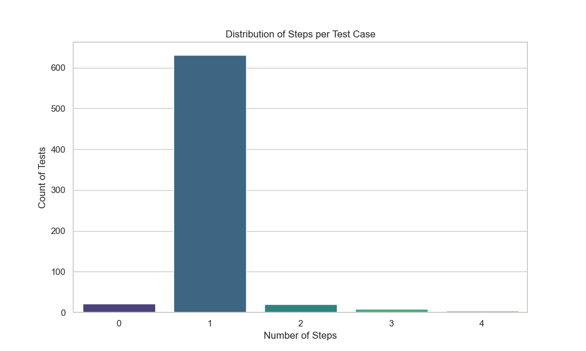
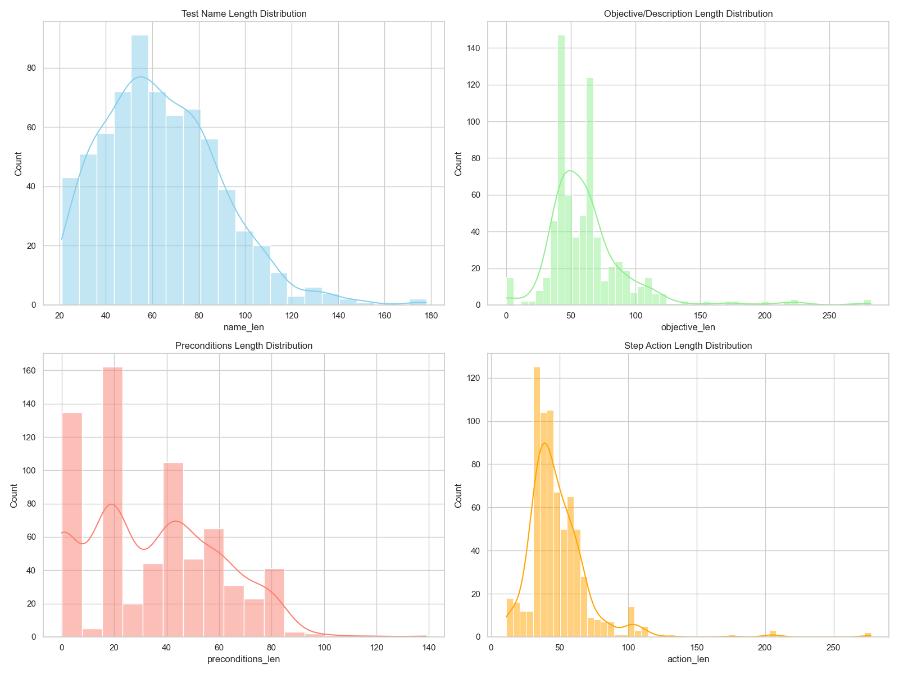
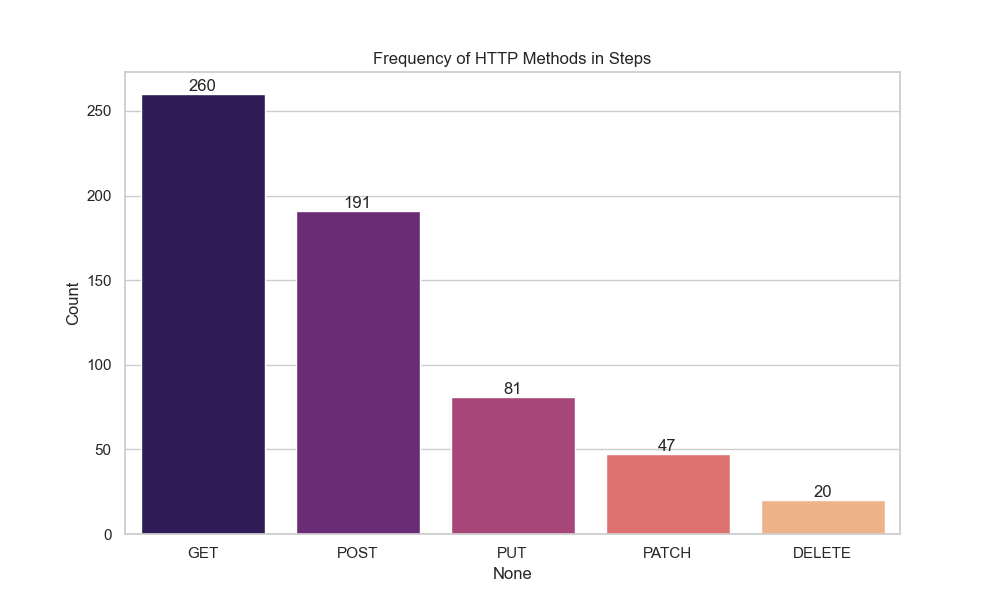

#  Data Analysis Report
**Dataset:** `augmented_tests.json`
**Total Tests:** 686
**Total Steps:** 714

## 1. Executive Summary
The dataset is highly **atomic**, with an average of **1.04** steps per test.
The dominant HTTP method is **GET**, appearing in **36.4%** of all steps.

## 2. Structural Analysis (Complexity)
- **Skewness:** 3.59 (High positive skew means mostly short tests).
- **Kurtosis:** 22.96 (High kurtosis means outlier "long" tests are rare).

## 3. Content Analysis (Verbosity)
| Field | Mean Length | Median | Max | Std Dev |
| :--- | :--- | :--- | :--- | :--- |
| **Name** | 64.1 | 61.0 | 178 | 25.6 |
| **Objective** | 62.8 | 57.5 | 282 | 34.7 |

## 4. API Coverage
The following chart shows the distribution of HTTP methods detected in the 'action' fields.

