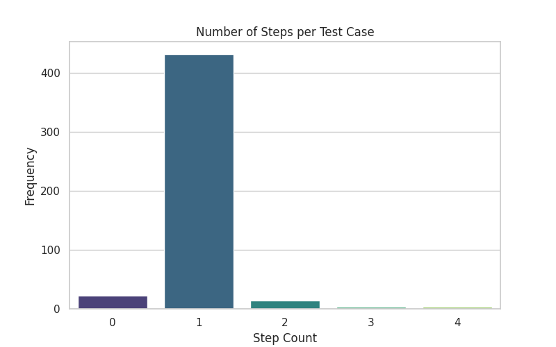
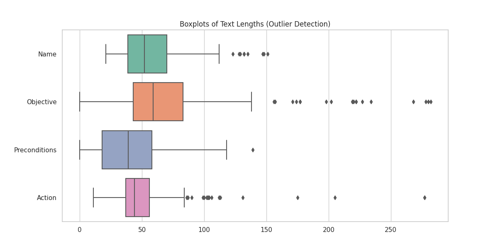
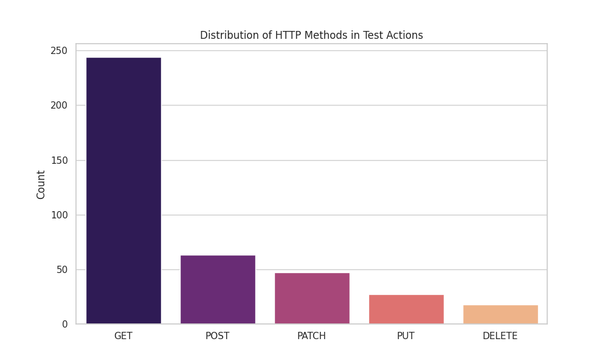

# Detailed Data Analysis Report: QA Backend Tests

## 1. Executive Summary
This report provides a comprehensive statistical analysis of the `simplified_tests.json` dataset.
- **Total Tests:** 476
- **Total Steps:** 488
- **Dominant Pattern:** Single-step tests primarily focusing on GET requests.

## 2. Structural Analysis
The dataset consists of flat test case definitions.

### 2.1 Steps per Test Case
Most tests are "atomic", containing only a single step.

| Metric | Value |
| :--- | :--- |
| Mean Steps | 1.03 |
| Max Steps | 4 |
| Skewness | 3.33 |

**Interpretation:** A skewness of 3.33 indicates a highly right-skewed distribution. The dataset is heavily weighted towards simple, 1-step verifications.

## 3. Content Analysis (Text Fields)
We analyzed the length (in characters) of key text fields to understand the verbosity and detail level of the tests.

### 3.1 Statistical Summary Table

| Field | Mean Length | Median | Max | Std Dev | Skewness |
| :--- | :--- | :--- | :--- | :--- | :--- |
| **Test Name** | 56.75 | 52.0 | 151 | 23.56 | 1.0 |
| **Objective** | 67.21 | 59.0 | 282 | 40.5 | 2.26 |
| **Preconditions** | 37.11 | 39.0 | 139 | 25.58 | 0.32 |

### 3.2 Visualizations
The histograms below show the distribution of text lengths.

**Outlier Analysis:**
The boxplot below highlights outliers in the text descriptions.

## 4. Functional Analysis (HTTP Methods)
By analyzing the `action` field of each step, we inferred the API methods being tested.

| Method | Count | Percentage |
| :--- | :--- | :--- |
| GET | 244 | 50.0% |
| POST | 63 | 12.9% |
| PATCH | 47 | 9.6% |
| PUT | 27 | 5.5% |
| DELETE | 18 | 3.7% |

## 5. Conclusions & Recommendations for AI Training
1.  **Imbalance:** The dataset is dominated by `GET` requests (50.0% of identified methods). An AI trained on this might struggle to generate valid `POST` or `PUT` payloads without additional examples.
2.  **Complexity:** The lack of multi-step scenarios (chains of 3+ steps) limits the model's ability to learn state-dependent testing (e.g., Create -> Verify -> Delete).
3.  **Data Quality:** Objectives are generally detailed (Mean 67.21 chars), which is good for training "Intent -> Test" models.